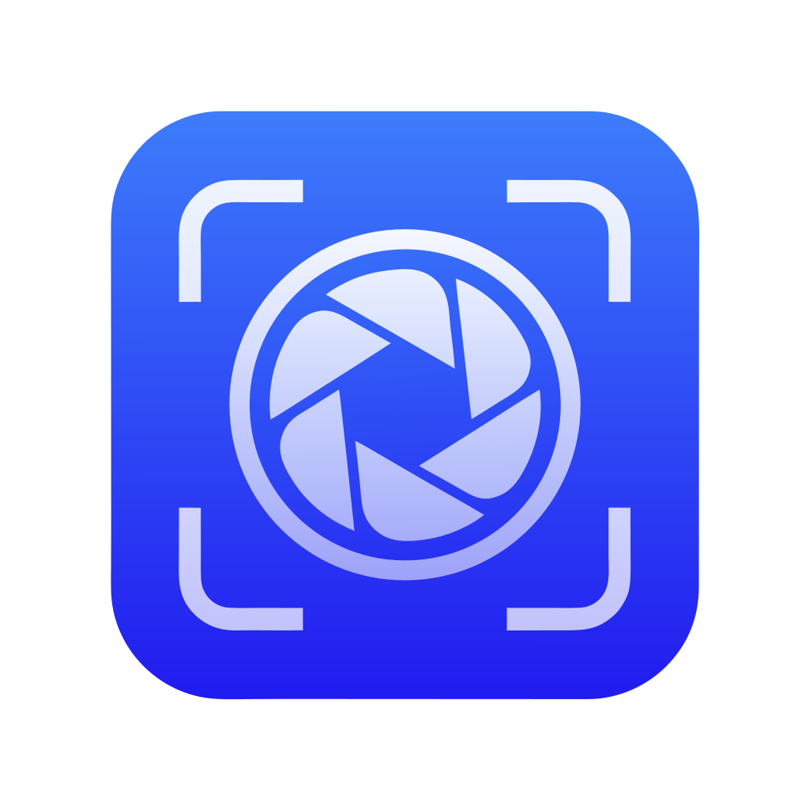
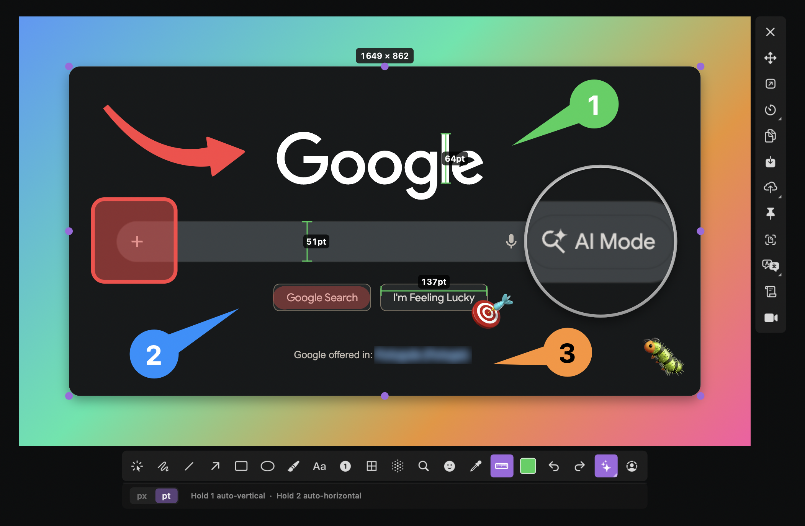

# macshot

<p align="center">
  
</p>

A native macOS screenshot tool inspired by [Flameshot](https://flameshot.org/). No Electron, no Qt, no bloat — just pure Swift and AppKit.

macshot lives in your menu bar and lets you capture, annotate, and share screenshots with a single hotkey.

<p align="center">
  
</p>

## Features

- **Screen recording** — record any region as MP4 (H.264) or GIF; interact with apps normally while recording, or toggle annotation mode to draw on the live screen; recordings saved to your configured folder
- **Instant capture** — global hotkey (default: `Cmd+Shift+X`) freezes your screen and lets you select a region
- **Editor window** — open any capture in a standalone resizable editor window; annotate, crop, copy, save, pin, or upload without dismissing the overlay
- **Crop tool** — editor window only; drag a rectangle to crop the image in place, annotations translate automatically
- **Window snap** — hover over any window to highlight it with a blue border and click to snap to it; `Tab` toggles snap mode, `F` captures full screen
- **Live QR & barcode detection** — automatically detects QR codes and barcodes in the selected area; shows an inline bar to open URLs or copy the payload
- **Annotation tools** — arrow, line, rectangle, filled rectangle, ellipse, pencil (with optional smooth strokes), marker/highlighter, text, numbered markers, pixelate, Gaussian blur
- **Color opacity** — drag the opacity slider in the color picker to set transparency for all drawing tools; marker keeps its own highlight opacity
- **Hover-to-move** — hover over any annotation with a drawing tool active to instantly drag, resize, or delete it without switching to the Select tool
- **Rich text** — bold, italic, underline, strikethrough, adjustable font size; `Enter` inserts a new line; confirm with ✓ button
- **Translation** — translate extracted OCR text to any language directly in the OCR results window
- **Shift-constrain** — hold Shift while drawing for straight lines, perfect circles, and squares
- **Auto-redact PII** — one-click detection and redaction of emails, phone numbers, credit cards, SSNs, API keys, and more
- **Delay capture** — set a 3/5/10 second timer to capture tooltips, menus, and hover states
- **Secure redaction** — pixelate tool is irreversible (multi-pass downscale, not a reversible blur)
- **Color picker** — 12 preset colors, one click to switch
- **Undo/Redo** — `Cmd+Z` / `Cmd+Shift+Z`
- **OCR text extraction** — extract text from any selected area using Apple Vision, with copy, search, and translation
- **Beautify mode** — wrap screenshots in a macOS window frame with traffic lights, shadow, and gradient background (6 styles)
- **Background removal** — remove the background from any selection using Apple Vision (macOS 14+)
- **Pin to screen** — pin a screenshot as a floating always-on-top window, movable and resizable; open in editor with the pencil button
- **Floating thumbnail** — thumbnail slides in after capture with Copy/Save/Pin/Edit/Upload action buttons on hover; multiple thumbnails stack vertically; configurable auto-dismiss delay (toggleable)
- **Screenshot history** — re-copy recent captures from the menu bar "Recent Captures" submenu (configurable, in-memory)
- **Upload to imgbb** — one-click upload; view and copy upload/delete URLs in Preferences → Uploads
- **Pixel dimensions** — always-visible size label above the selection, click to type an exact resolution
- **Quick save** — right-click a window (snap mode) or drag to instantly save to your configured folder
- **Output options** — copy to clipboard (`Cmd+C`), save to file (`Cmd+S`)
- **Multi-monitor support** — captures all screens simultaneously
- **Configurable hotkey** — change it in Preferences
- **Lightweight** — ~8 MB memory at idle, menu bar only (no dock icon)

## Install

### Homebrew

```bash
brew install sw33tlie/macshot/macshot
```

### Manual

Download the latest `.dmg` from [Releases](https://github.com/sw33tLie/macshot/releases), open it, and drag `macshot.app` to `/Applications`.

### Build from source

Requires Xcode 16+ and macOS 14+.

```bash
git clone https://github.com/sw33tLie/macshot.git
cd macshot
xcodebuild -project macshot.xcodeproj -scheme macshot -configuration Release -derivedDataPath build clean build
cp -R build/Build/Products/Release/macshot.app /Applications/
```

## Usage

1. Launch macshot — it appears as an icon in your menu bar
2. Press `Cmd+Shift+X` (or click "Capture Screen" from the menu bar)
3. Drag to select a region, or hover over a window and click to snap to it
4. Annotate using the toolbar below the selection
5. Press `Cmd+C` to copy to clipboard, or `Cmd+S` to save to file
6. Press `Esc` to cancel at any time

### Keyboard shortcuts

| Shortcut | Action |
|---|---|
| `Cmd+Shift+X` | Capture screen (configurable) |
| `Enter` | Confirm and copy to clipboard |
| `Cmd+C` | Copy to clipboard |
| `Cmd+S` | Save to file |
| `Cmd+Z` | Undo |
| `Cmd+Shift+Z` | Redo |
| `Esc` | Cancel |
| `Tab` | Toggle window snap mode |
| `F` | Capture full screen (snap mode) |
| `Right-click` | Quick save/copy snapped window (snap mode) |
| `Right-click` + drag | Quick save to file (no annotation) |
| `Shift` (while drawing) | Constrain to straight lines / perfect shapes |

### Permissions

macshot requires **Screen Recording** permission. macOS will prompt you on first capture. If it doesn't work:

1. Open **System Settings > Privacy & Security > Screen Recording**
2. Enable macshot (or remove and re-add it)
3. Restart macshot

## Requirements

- macOS 14.0 (Sonoma) or later

## License

[MIT](LICENSE)
